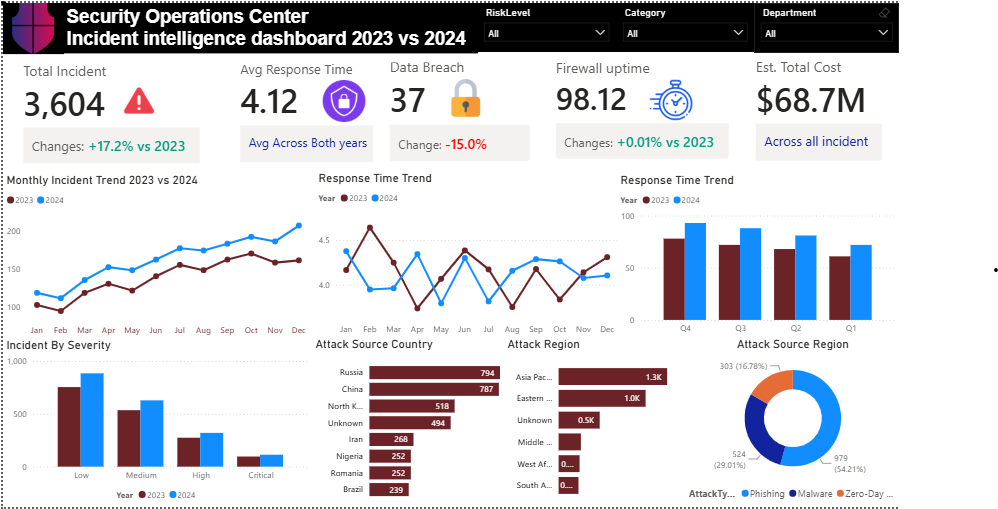

# Security-Operations-Center-Incident-intelligence-Dashboard

## Project Overview

The Cybersecurity Incident Monitoring Dashboard is a one-page interactive Power BI dashboard designed to provide a centralized view of security incidents, threat intelligence, operational efficiency, and system performance.

The dashboard helps Security Operations Center (SOC) teams and management monitor cybersecurity risks, identify attack patterns, track response performance, and make informed security decisions.

---

## Business Problem

A growing cybersecurity company managing multiple clients across different regions lacked a centralized reporting solution for monitoring security incidents.

### Challenges

* No clear visibility into total incidents and trends over time
* Difficulty tracking response times and SOC team efficiency
* Limited insight into data breaches and firewall uptime
* No structured analysis of severity and risk levels
* Limited understanding of attack origins and threat patterns
* Difficulty identifying top threat groups
* Manual investigation of incident logs and resolution status

---

## Objective

Develop a single-page executive dashboard that enables stakeholders to:

* Monitor overall security performance
* Analyze incident trends and patterns
* Track response and resolution efficiency
* Identify high-risk attack sources
* Monitor data breaches and firewall uptime
* Support proactive cybersecurity decision-making

---

## Dashboard Components

### Key Performance Indicators (KPIs)

* Total Incidents
* Incident YoY %
* Average Response Time (Hours)
* Data Breach Incidents
* Firewall Uptime %

### Incident Analysis

* Monthly Incident Trend
* Incident Status Distribution
* Resolution Time by Attack Type
* Attack Type Breakdown

  * Phishing
  * Malware
  * SQL Injection
  * DDoS
  * Ransomware
  * Insider Threat

### Risk & Severity Monitoring

* Incidents by Severity

  * Low
  * Medium
  * High
  * Critical

* Incidents by Risk Level

### Threat Intelligence

* Attack Sources by Country
* Attack Sources by Region
* Top Threat Groups

### Operational Monitoring

* Response Time Analysis
* Resolution Time Tracking
* Open vs Resolved Incidents

### Detailed Incident Log

Interactive table containing:

* Incident ID
* Date
* Client
* Attack Type
* Severity
* Risk Level
* Country
* Region
* Threat Group
* Response Time
* Resolution Time
* Status
* Data Breach Indicator

---

## Data Model

### Fact Table

**Fact_Incidents**

Contains incident-level transactional data including:

* Incident ID
* Date
* Attack Type
* Severity
* Risk Level
* Threat Group
* Country
* Region
* Response Time
* Resolution Time
* Status
* Data Breach Flag
* Firewall Uptime

### Dimension Tables

* Date Dimension
* Attack Type Dimension
* Severity Dimension
* Risk Level Dimension
* Threat Group Dimension
* Location Dimension

---

## Key Metrics

### Total Incidents

Measures the total number of security incidents recorded.

### Incident YoY %

Compares incident volume against the previous year.

### Average Response Time

Measures SOC responsiveness to incidents.

### Data Breach Incidents

Tracks incidents involving confirmed data breaches.

### Firewall Uptime %

Monitors system availability and infrastructure health.

---

## Tools & Technologies

* Power BI
* DAX
* Power Query
* SQL
* Data Modeling
* ETL Processes

---

## Business Impact

This dashboard provides a centralized cybersecurity monitoring solution that helps:

* Improve visibility into security operations
* Detect trends and threats earlier
* Reduce incident response times
* Monitor operational efficiency
* Strengthen risk management strategies
* Support data-driven security decisions

---
## Dashboard Preview

  

---
## Author

**Sagar Kori**

Data Analyst | Power BI | SQL | DAX | Data Modeling
